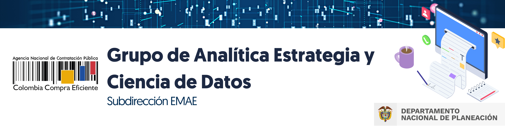

# Col contrata

Col_contrata es una iniciativa del grupo de analítica, estrategia y ciencia de datos de la agencia nacional de contratación pública.

## EMAE
La Subdirección de Estudios de Mercado y Abastecimiento Estratégico fue creada en el año 2019 mediante el Decreto 1822, con el objetivo de generar lineamientos e insumos estratégicos para cada una de las áreas misionales de la entidad, con base en metodologías de abastecimiento estratégico, monitoreo de mercados, proyectos de innovación y programas de analítica de datos, que le permitan a la Agencia multiplicar el impacto de las políticas públicas adoptadas en el mercado de compra pública y contratación estatal.

## Realizado por el grupo SEMAE
- Carlos Isaac
- Miguel Rippe
- Roy Gomez
- Hubert Quiñones
