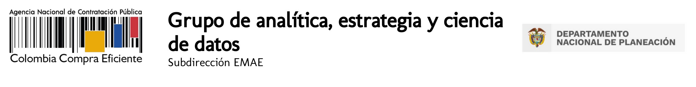

# Col contrata

Lorem ipsum dolor, sit amet consectetur adipisicing elit. Culpa assumenda numquam quo ea neque recusandae libero blanditiis quae aspernatur esse debitis iusto molestiae, iste perferendis eaque cupiditate at ex omnis.

## EMAE
La Subdirección de Estudios de Mercado y Abastecimiento Estratégico fue creada en el año 2019 mediante el Decreto 1822, con el objetivo de generar lineamientos e insumos estratégicos para cada una de las áreas misionales de la entidad, con base en metodologías de abastecimiento estratégico, monitoreo de mercados, proyectos de innovación y programas de analítica de datos, que le permitan a la Agencia multiplicar el impacto de las políticas públicas adoptadas en el mercado de compra pública y contratación estatal.

### titulo 2

Lorem ipsum dolor, sit amet consectetur adipisicing elit. Culpa assumenda numquam quo ea neque recusandae libero blanditiis quae aspernatur esse debitis iusto molestiae, iste perferendis eaque cupiditate at ex omnis.

#### titulo 3

Lorem ipsum dolor, sit amet consectetur adipisicing elit. Culpa assumenda numquam quo ea neque recusandae libero blanditiis quae aspernatur esse debitis iusto molestiae, iste perferendis eaque cupiditate at ex omnis.

## Example tag usage

## Header 1
### Header 2
#### Header 3
**bold**
*italic*

### Cuadros de programacion

> blockquotes

~~~python
import os,time
print ("Biscuit")
~~~

> blockquotes 2

~~~python
import os,time
print ("Biscuit")
~~~
> blockquotes 3

~~~python
import os,time
print ("Biscuit")
~~~
> blockquotes 4

~~~python
import os,time
print ("Biscuit")
~~~

> blockquotes 5

~~~python
import os,time
print ("Biscuit")
~~~

## Realizado por el grupo SEMAE
- Carlos Isaac
- Miguel Rippe
- Roy Gomez
- Hubert Quiñones
